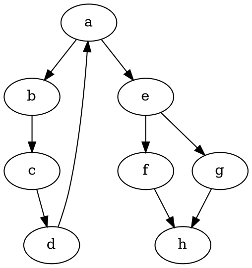

# CSE 464 Project Part 1: Graph Parser
**Author:** Sai Mahesh Nomula (snomula)  
**GitHub Repository:** [https://github.com/Sai-2811/CSE464-2026-smahesh](https://github.com/Sai-2811/CSE464-2026-smahesh)

Hi! This is my submission for Part 1 of the CSE 464 course project. For this assignment, I built a Java application that can parse, manipulate, and export directed graphs using DOT files.

## My Environment Setup
To get everything working, I used the following setup on my machine:
- **Java:** JDK 11 (or higher)
- **Build Tool:** Maven 3.8+
- **IDE:** IntelliJ IDEA Community Edition
- **Graphviz:** Installed system-wide so I could use the `dot` command line tool for rendering images directly from my Java code.

## Building and Running My Code

If you want to build my project from scratch and run the tests, you can use Maven:

```bash
mvn clean package
```

To run the actual application and see it parse the sample graph, add nodes/edges, and generate the final outputs, you can run:

```bash
mvn exec:java -Dexec.mainClass="edu.asu.cse464.Main"
```

## How It Works (Features & Outputs)

I started by creating a sample DOT file (`input.dot`) to test my parser. Here is what my input file looks like:



Below, I've included snapshots of my terminal output to show that all four features are working properly. To make it easy to read, I've boxed my terminal outputs below.

### Feature 1: Parsing the DOT Graph
When my program reads `input.dot`, it successfully identifies all the nodes and directed edges. Here is the snapshot of my terminal printing the parsed graph details:

```text
======================================================================
=== Parsed Graph ===
Number of nodes: 8
Node labels: a, b, c, d, e, f, g, h
Number of edges: 9
Edges: a -> b, b -> c, c -> d, d -> a, a -> e, e -> f, e -> g, f -> h, g -> h
======================================================================
```

### Features 2 & 3: Adding Nodes and Edges
Next, I implemented the ability to add new nodes and directed edges. I also added validation to make sure duplicate nodes or edges throw an `IllegalArgumentException`. 

In my demo, I added a new node `x`, a list of nodes `[y, z]`, and then connected them with edges `x -> y` and `y -> z`. Here is the snapshot of the updated graph printed to my console:

```text
======================================================================
=== Updated Graph ===
Number of nodes: 11
Node labels: a, b, c, d, e, f, g, h, x, y, z
Number of edges: 11
Edges: a -> b, b -> c, c -> d, d -> a, a -> e, e -> f, e -> g, f -> h, g -> h, x -> y, y -> z
======================================================================
```

### Running the Unit Tests
I wrote JUnit 5 tests to cover all of the graph features (parsing, adding nodes, adding edges, duplicates, and exporting). When I run `mvn test`, all 8 tests pass successfully. Here is the snapshot from my Maven test run:

```text
======================================================================
[INFO] -------------------------------------------------------
[INFO]  T E S T S
[INFO] -------------------------------------------------------
[INFO] Running edu.asu.cse464.GraphTest
[INFO] Tests run: 8, Failures: 0, Errors: 0, Skipped: 0, Time elapsed: 0.055 s -- in edu.asu.cse464.GraphTest
[INFO] 
[INFO] Results:
[INFO] 
[INFO] Tests run: 8, Failures: 0, Errors: 0, Skipped: 0
[INFO] 
[INFO] ------------------------------------------------------------------------
[INFO] BUILD SUCCESS
======================================================================
```

### Feature 4: Exporting Output to DOT and PNG
Finally, my program successfully exports the in-memory graph back out to a `.dot` file and uses Graphviz to render it into a PNG image. 

Here is the confirmation from my console:
```text
======================================================================
DOT and PNG exported successfully.
======================================================================
```

And here is the actual `output.png` image that my program generated:


## My GitHub Commits
I made sure to commit my work frequently and logically, keeping each feature in a separate commit as requested by the assignment. You can find the links to my specific commits here:

- **Feature 1 (Parse Graph):** [View Commit](https://github.com/Sai-2811/CSE464-2026-smahesh/commit/ddf4e16)
- **Feature 2 (Add Nodes & Duplicates Check):** [View Commit](https://github.com/Sai-2811/CSE464-2026-smahesh/commit/8307f4c)
- **Feature 3 (Add Directed Edges):** [View Commit](https://github.com/Sai-2811/CSE464-2026-smahesh/commit/373a9b5)
- **Feature 4 (Export to DOT & PNG):** [View Commit](https://github.com/Sai-2811/CSE464-2026-smahesh/commit/42a10c6)
- **Unit Tests:** [View Commit](https://github.com/Sai-2811/CSE464-2026-smahesh/commit/c1f9066)

## Part 2 Features
In Part 2, additional features were added per the requirements. Here are the relevant links for verification:

- **Continuous Integration (CI):** A GitHub Actions workflow builds and tests the code.
  - [View CI Actions](https://github.com/Sai-2811/CSE464-2026-smahesh/actions)
- **Remove APIs:** APIs to remove nodes and edges with robust test coverage.
  - [View Commit (7fe4985)](https://github.com/Sai-2811/CSE464-2026-smahesh/commit/7fe4985)
- **BFS Branch and Feature:** Breadth-First GraphSearch algorithm.
  - [View `bfs` Branch](https://github.com/Sai-2811/CSE464-2026-smahesh/tree/bfs)
  - [View BFS Commit (de7ac3a)](https://github.com/Sai-2811/CSE464-2026-smahesh/commit/de7ac3a)
- **DFS Branch and Feature:** Depth-First GraphSearch algorithm.
  - [View `dfs` Branch](https://github.com/Sai-2811/CSE464-2026-smahesh/tree/dfs)
  - [View DFS Commit (13a7e5d)](https://github.com/Sai-2811/CSE464-2026-smahesh/commit/13a7e5d)
- **Merge & Conflict Resolution:** The `bfs` and `dfs` branches were merged into `main` and conflicts resolved using an `Algorithm` enum.
  - [View Merge Commit (a193f97)](https://github.com/Sai-2811/CSE464-2026-smahesh/commit/a193f97)

Thanks for taking the time to review my project! Let me know if you have any questions.
