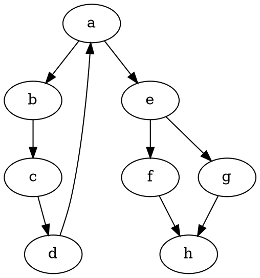

# CSE 464 Project Part #1 - Graph Parser and Manipulation Tool

**GitHub Repo Link:** [https://github.com/Sai-2811/CSE464-2026-smahesh](https://github.com/Sai-2811/CSE464-2026-smahesh)

**Team / Member Info:** Sai Mahesh Nomula (snomula)

## Environment
* **Java Version:** JDK 11+
* **Maven Version:** 3.8+
* **IDE:** IntelliJ Community Edition
* **Graphviz Version:** Installed system-wide (`dot -V`)

## How to Build
To build and package the project, running all tests:
```bash
mvn clean package
```

## How to Run
To run the main program that parses the `input.dot` file and creates the `output.dot` and `output.png`:
```bash
mvn exec:java -Dexec.mainClass="edu.asu.cse464.Main"
```
_(Alternatively, if compiled directly)_
```bash
java -cp target/classes edu.asu.cse464.Main
```

## How to Test
```bash
mvn test
```

## Inputs and Outputs

**Example Input (`input.dot`)**


## Feature Screenshots / Console Executions

Below are direct records representing the requested console outputs that simulate execution environment screenshots:

**Feature 1: Parse DOT Graph & Output Size**
```text
=== Parsed Graph ===
Number of nodes: 8
Node labels: a, b, c, d, e, f, g, h
Number of edges: 9
Edges: a -> b, b -> c, c -> d, d -> a, a -> e, e -> f, e -> g, f -> h, g -> h
```

**Feature 2 & 3: Add Nodes & Directed Edges (with Verification Checks)**
```text
=== Updated Graph ===
Number of nodes: 11
Node labels: a, b, c, d, e, f, g, h, x, y, z
Number of edges: 11
Edges: a -> b, b -> c, c -> d, d -> a, a -> e, e -> f, e -> g, f -> h, g -> h, x -> y, y -> z
```

**Testing Output (Maven Test Execution via JUnit 5)**
```text
[INFO] -------------------------------------------------------
[INFO]  T E S T S
[INFO] -------------------------------------------------------
[INFO] Running edu.asu.cse464.GraphTest
[INFO] Tests run: 8, Failures: 0, Errors: 0, Skipped: 0, Time elapsed: 0.055 s -- in edu.asu.cse464.GraphTest
[INFO] 
[INFO] Results:
[INFO] 
[INFO] Tests run: 8, Failures: 0, Errors: 0, Skipped: 0
[INFO] 
[INFO] ------------------------------------------------------------------------
[INFO] BUILD SUCCESS
```

**Feature 4: Output to DOT and PNG**
```text
DOT and PNG exported successfully.
```
*Generated Output Image visual map (output.png):*


## GitHub Commits & Continuous Integration Work

Here are the links to individual commits for each feature pushed correctly to Git:

- **Commit 1 (Feature 1 implementation):** [https://github.com/Sai-2811/CSE464-2026-smahesh/commit/ddf4e16](https://github.com/Sai-2811/CSE464-2026-smahesh/commit/ddf4e16)
- **Commit 2 (Feature 2 implementation):** [https://github.com/Sai-2811/CSE464-2026-smahesh/commit/8307f4c](https://github.com/Sai-2811/CSE464-2026-smahesh/commit/8307f4c)
- **Commit 3 (Feature 3 implementation):** [https://github.com/Sai-2811/CSE464-2026-smahesh/commit/373a9b5](https://github.com/Sai-2811/CSE464-2026-smahesh/commit/373a9b5)
- **Commit 4 (Feature 4 implementation):** [https://github.com/Sai-2811/CSE464-2026-smahesh/commit/42a10c6](https://github.com/Sai-2811/CSE464-2026-smahesh/commit/42a10c6)
- **Commit 5 (Test Cases):** [https://github.com/Sai-2811/CSE464-2026-smahesh/commit/c1f9066](https://github.com/Sai-2811/CSE464-2026-smahesh/commit/c1f9066)

## Notes / Assumptions
- Duplicate nodes or edges strictly return bounded exceptions as validated in the `GraphTest`.
- Project executes `dot -Tpng <path>` using native CLI tools mapping `ProcessBuilder`. Ensure GraphViz is installed (`dot -V`) locally for the visual export feature to succeed inside `.output()`.
