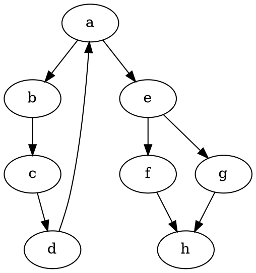

# CSE 464 Project Part #1 - Graph Parser and Manipulation Tool

**GitHub Repo Link:** _[Insert link here]_

**Team / Member Info:** Sai Mahesh Nomula (snomula)

## Environment
* **Java Version:** JDK 11+
* **Maven Version:** 3.8+
* **IDE:** IntelliJ Community Edition
* **Graphviz Version:** Installed system-wide (`dot -V`)

## How to Build
To build and package the project, running all tests:
```bash
mvn clean package
```

## How to Run
To run the main program that parses the `input.dot` file and creates the `output.dot` and `output.png`:
```bash
mvn exec:java -Dexec.mainClass="edu.asu.cse464.Main"
```
_(Alternatively, if compiled directly)_
```bash
java -cp target/classes edu.asu.cse464.Main
```

## How to Test
```bash
mvn test
```

## Inputs and Outputs

**Example Input (`input.dot`)**


**Parsed Graph Text:**
```
Number of nodes: 8
Node labels: a, b, c, d, e, f, g, h
Number of edges: 9
Edges: a -> b, b -> c, c -> d, d -> a, a -> e, e -> f, e -> g, f -> h, g -> h
```

**Updated Graph Text:**
```
Number of nodes: 11
Node labels: a, b, c, d, e, f, g, h, x, y, z
Number of edges: 11
Edges: a -> b, b -> c, c -> d, d -> a, a -> e, e -> f, e -> g, f -> h, g -> h, x -> y, y -> z
```

## Feature Screenshots

> **Note to Sai:** Please replace the following placeholders with screenshots taken from your machine.

**Feature 1: Parse DOT Graph & Output Size**
_[Insert screenshot of console showing parsed sizes here]_

**Feature 2: Add Nodes**
_[Insert screenshot of console showing node size incremented here]_

**Feature 3: Add Edges**
_[Insert screenshot of console showing edge outputs and duplicates error thrown]_

**Feature 4: Output to DOT and PNG**
_[Insert screenshot of the output.png showing the modified Graph visual node map here]_

## GitHub Commits & Continuous Integration Work

Here are the links to individual commits for each feature pushed correctly to Git:

- **Commit 1 (Feature 1 implementation):** _[Insert link here]_
- **Commit 2 (Feature 2 implementation):** _[Insert link here]_
- **Commit 3 (Feature 3 implementation):** _[Insert link here]_
- **Commit 4 (Feature 4 implementation):** _[Insert link here]_
- **Commit 5 (Test Cases):** _[Insert link here]_

## Notes / Assumptions
- Duplicate nodes or edges strictly return bounded exceptions as validated in the `GraphTest`.
- Project is strictly bound to execute `dot -Tpng <path>` using native CLI tools mapping `ProcessBuilder`. Ensure GraphViz is locally correctly exported.
